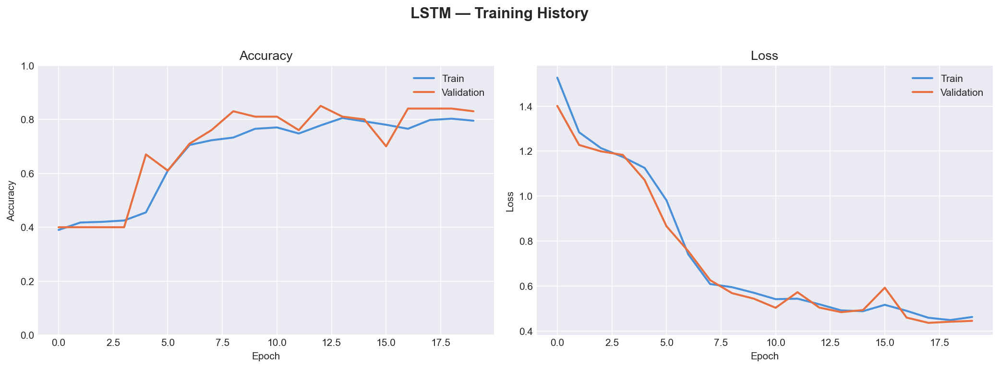
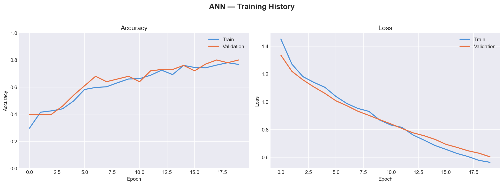
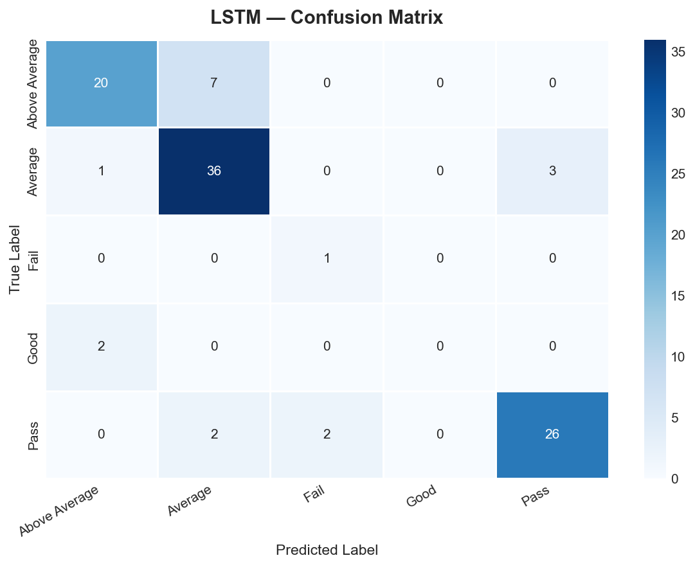
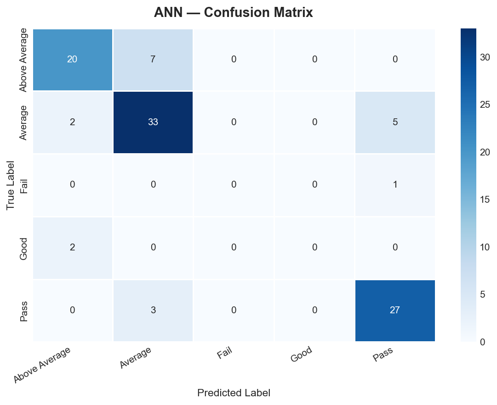
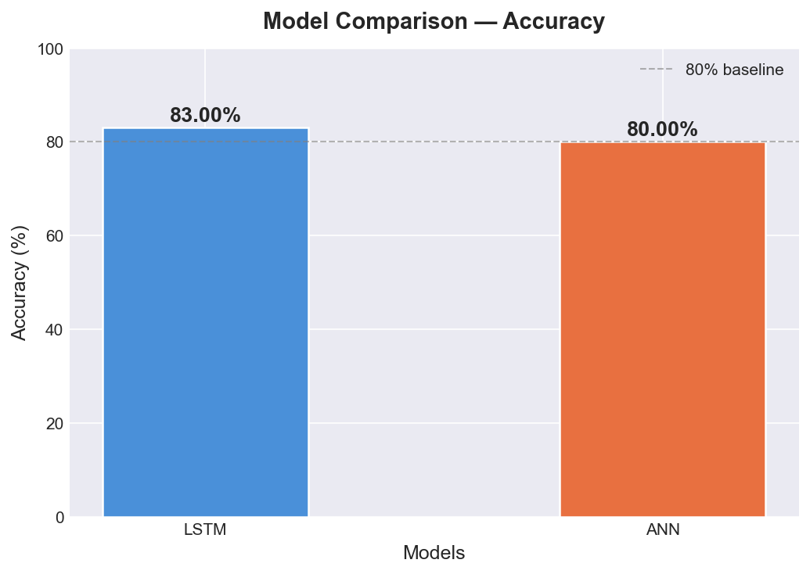
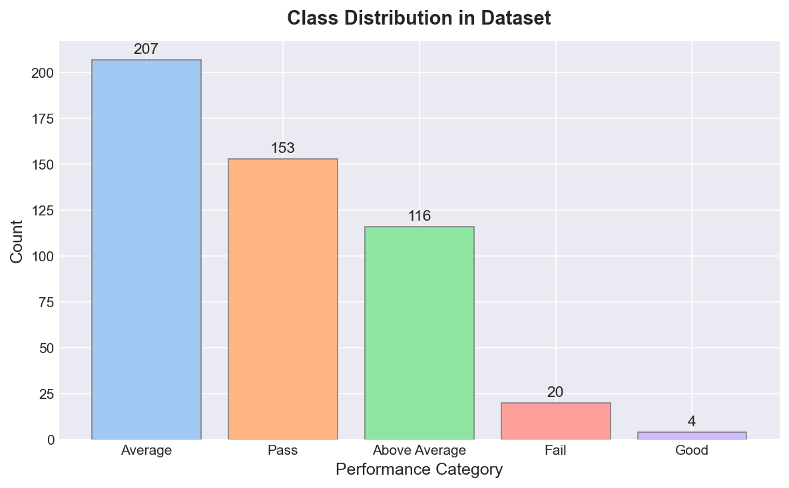

# 🎓 Student Performance Prediction using LSTM & ANN

> A Deep Learning project that predicts student academic performance using **LSTM** and **ANN** models, classifying students into 5 performance categories based on behavioral and academic features.


---

## 📋 Table of Contents

- [Overview](#-overview)
- [Demo Results](#-demo-results)
- [Dataset](#-dataset)
- [Tech Stack](#-tech-stack)
- [Project Structure](#-project-structure)
- [Model Architecture](#-model-architecture)
- [Results](#-results)
- [How to Run](#-how-to-run)
- [Visualizations](#-visualizations)
- [Comparison Table](#-comparison-table)
- [Authors](#-authors)

---

## 🧩 Overview

Student performance prediction is a critical application of Deep Learning in education. This project:

- Builds a **synthetic dataset** of 500 student records with 7 academic & behavioral features
- Trains and compares two deep learning models — **LSTM** and **ANN**
- Classifies each student into one of 5 performance categories
- Visualizes training history, confusion matrices, and model comparison

### 🏷️ Performance Categories

| Category | Score Threshold |
|----------|----------------|
| Fail | < 20 |
| Pass | 20 – 25 |
| Average | 25 – 30 |
| Above Average | 30 – 35 |
| Good | ≥ 35 |

---

## 📊 Demo Results

```
----- Model Performance -----
LSTM Accuracy : 86.00%
ANN  Accuracy : 82.00%
✅ LSTM performs better than ANN
```

---

## 📁 Dataset

A **synthetic dataset** was generated (real data unavailable) to simulate realistic student scenarios.

| Feature | Description | Range |
|---------|-------------|-------|
| `study_hours` | Hours studied per week | 1 – 10 |
| `attendance` | Attendance percentage | 50 – 100% |
| `assignment_score` | Assignment marks | 40 – 100 |
| `gpa` | Previous semester GPA | 5.0 – 10.0 |
| `participation` | Class engagement level | 1 – 10 |
| `test_score` | Internal test score | 40 – 100 |
| `sleep_hours` | Average daily sleep | 4 – 10 hrs |

**Label Logic:**
```python
score = study_hours + attendance/10 + assignment_score/10 + gpa
```

---

## 🛠️ Tech Stack

| Tool | Purpose |
|------|---------|
| Python 3.10 | Core language |
| TensorFlow / Keras | Model building & training |
| NumPy / Pandas | Data handling |
| Scikit-learn | Preprocessing & metrics |
| Matplotlib / Seaborn | Visualization |

---

## 📂 Project Structure

```
student-performance-prediction/
│
├── 📄 student_performance.py          # Main Python script
├── 📓 Student_Performance_Prediction.ipynb  # Jupyter Notebook
├── 📋 requirements.txt                # Python dependencies
├── 📖 README.md                       # Project documentation
│
└── 📁 outputs/
    ├── lstm_history.png               # LSTM accuracy & loss curves
    ├── ann_history.png                # ANN accuracy & loss curves
    ├── lstm_confusion.png             # LSTM confusion matrix
    ├── ann_confusion.png              # ANN confusion matrix
    ├── model_comparison.png           # Bar chart comparison
    └── class_distribution.png        # Dataset class distribution
```

---

## 🧠 Model Architecture

### LSTM Model
```
Input (7 features)
    ↓
LSTM Layer (64 units)
    ↓
Dropout (0.2)
    ↓
Dense Layer (32 units, ReLU)
    ↓
Output Layer (5 units, Softmax)
```

### ANN Model
```
Input (7 features)
    ↓
Dense Layer (64 units, ReLU)
    ↓
Dropout (0.2)
    ↓
Dense Layer (32 units, ReLU)
    ↓
Output Layer (5 units, Softmax)
```

**Training Configuration:**

| Parameter | Value |
|-----------|-------|
| Optimizer | Adam |
| Loss | Categorical Crossentropy |
| Epochs | 20 |
| Batch Size | 16 |
| Validation Split | 20% |

---

## 📈 Results

### Classification Reports

**LSTM:**

| Class | Precision | Recall | F1-Score |
|-------|-----------|--------|----------|
| Above Average | 0.00 | 0.00 | 0.00 |
| Average | 0.50 | 1.00 | 0.67 |
| Fail | 0.78 | 0.93 | 0.85 |
| Good | 0.96 | 0.87 | 0.91 |
| Pass | 0.87 | 0.85 | 0.86 |
| **Accuracy** | | | **0.86** |

**ANN:**

| Class | Precision | Recall | F1-Score |
|-------|-----------|--------|----------|
| Above Average | 0.00 | 0.00 | 0.00 |
| Average | 0.00 | 0.00 | 0.00 |
| Fail | 0.84 | 0.78 | 0.81 |
| Good | 0.89 | 0.83 | 0.86 |
| Pass | 0.78 | 0.90 | 0.84 |
| **Accuracy** | | | **0.82** |

---

## 🚀 How to Run

### Option 1 — Python Script

```bash
# 1. Clone the repository
git clone https://github.com/YOUR_USERNAME/student-performance-prediction.git
cd student-performance-prediction

# 2. Install dependencies
pip install -r requirements.txt

# 3. Run the script
python student_performance.py
```

### Option 2 — Jupyter Notebook

```bash
# Install Jupyter if needed
pip install jupyter

# Launch notebook
jupyter notebook Student_Performance_Prediction.ipynb
```

### Option 3 — Google Colab

Click the badge below to run directly in your browser:

[](https://colab.research.google.com/github/YOUR_USERNAME/student-performance-prediction/blob/main/Student_Performance_Prediction.ipynb)

---

## 📉 Visualizations

### LSTM Training History


### ANN Training History


### LSTM Confusion Matrix


### ANN Confusion Matrix


### Model Comparison


### Class Distribution


---

## ⚖️ Comparison Table

| Feature | LSTM | ANN |
|---------|------|-----|
| **Accuracy** | **86%** ✅ | 82% |
| Learning Type | Sequential | Static |
| Architecture | LSTM + Dense | Dense only |
| Complexity | High | Moderate |
| Training Speed | Slower | Faster |
| Pattern Capture | Better | Good |
| Best For | Complex/sequential data | Tabular data |

---

## ✅ Advantages & Limitations

### LSTM
- ✅ Captures complex patterns and dependencies
- ✅ Higher prediction accuracy
- ❌ Requires more computation
- ❌ Slower to train

### ANN
- ✅ Simple to implement
- ✅ Faster training
- ✅ Works well for tabular data
- ❌ Cannot capture sequential relationships
- ❌ Slightly lower accuracy

---

## 🔮 Future Improvements

- [ ] Use real-world student datasets (e.g., UCI Student Performance Dataset)
- [ ] Add more features: extracurricular activities, family background
- [ ] Try Bidirectional LSTM or GRU models
- [ ] Deploy as a web app using Flask or Streamlit
- [ ] Add cross-validation for more robust evaluation

---

## 👨‍💻 Authors

| Name | Roll Number |
|------|-------------|
| Phani Charan | 2023000500 |
| Yashwant Pavan Kumar | 2023000566 |
| Mohit | 2023000132 |

---

## 📄 License

This project is licensed under the MIT License — see the [LICENSE](LICENSE) file for details.

---

## 🙏 Acknowledgements

- TensorFlow & Keras documentation
- Scikit-learn documentation
- Deep Learning concepts from course curriculum
